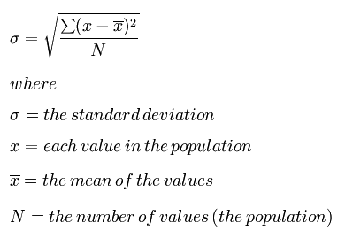

> ## Learning Objectives {.objectives}
> 
> *   Learn about the benefits and drawbacks of Test Driven Development
> *   Write a test before writing the code

Test-driven Development (TDD) takes the workflow of writing code and writing
tests and turns it on its head. TDD is a software development process where you
write the tests first. Before you write a single line of a function, you
first write the test for that function.

After you write a test, you are then allowed to proceed to write the function
that you are testing.  However, you are only supposed to implement enough of
the function so that the test passes. If the function does not do what is
needed, you write another test and then go back and modify the function.  You
repeat this process of test-then-implement until the function is completely
implemented for your current needs.

> ## You Do You {.callout}
>
> Developers who practice strict TDD will tell you that it is the best thing since
> sliced arrays.  The central claim to TDD is that at the end of the process you have an
> implementation that is well tested for your use case, and the process itself is
> more efficient. You stop when your tests pass and you do not need any more
> features. You do not spend any time implementing options and features on the off
> chance that they will prove helpful later. You get what you need when you need it,
> and no more. TDD is a very powerful idea, though it can be hard to follow religiously.
> 
> The most important takeaway from test-driven development is that the moment
> you start writing code, you should be considering how to test that code. The
> tests should be written and presented in tandem with the implementation. **Testing
> is too important to be an afterthought.**
> 
> Whether to pursue classic TDD is a personal decision. This design philosophy
> was most strongly put forth by Kent Beck in his book _Test-Driven 
> Development: By Example_.
> 

The following example illustrates TDD for a standard deviation function, `std()`.

To start, we write a test for computing the standard deviation from
a list of numbers as follows:

~~~ {.python}
from nose.tools import assert_equal

from mod import std

def test_std1():
    obs = std([0.0, 2.0])
    exp = 1.0
    assert_equal(obs, exp)
~~~

Next, we write the _minimal_ version of `std()` that will cause `test_std1()` to
pass:

~~~ {.python}
def std(vals):
    # surely this is cheating...
    return 1.0
~~~

As you can see, the minimal version simply returns the expected result for the
sole case that we are testing.  If we only ever want to take the standard
deviation of the numbers 0.0 and 2.0, or 1.0 and 3.0, and so on, then this
implementation will work perfectly. If we want to branch out, then we probably
need to write more robust code.  However, before we can write more code, we first
need to add another test or two:

~~~ {.python}
def test_std1():
    obs = std([0.0, 2.0])
    exp = 1.0
    assert_equal(obs, exp)

def test_std2():
    # Test the fiducial case when we pass in an empty list.
    obs = std([])
    exp = 0.0
    assert_equal(obs, exp)

def test_std3():
    # Test a real case where the answer is not one.
    obs = std([0.0, 4.0])
    exp = 2.0
    assert_equal(obs, exp)
~~~

A simple function implementation that would make these tests pass could be as follows:

~~~ {.python}
def std(vals):
    # a little better
    if len(vals) == 0: # Special case the empty list.
        return 0.0
    return vals[-1] / 2.0 # By being clever, we can get away without doing real work.
~~~

Are we done? No. Of course not. Even though the tests all pass, this is clearly
still not a generic standard deviation function. To create a better
implementation, TDD states that we again need to expand the test suite:

~~~ {.python}
def test_std1():
    obs = std([0.0, 2.0])
    exp = 1.0
    assert_equal(obs, exp)

def test_std2():
    obs = std([])
    exp = 0.0
    assert_equal(obs, exp)

def test_std3():
    obs = std([0.0, 4.0])
    exp = 2.0
    assert_equal(obs, exp)

def test_std4():
    # The first value is not zero.
    obs = std([1.0, 3.0])
    exp = 1.0
    assert_equal(obs, exp)

def test_std5():
    # Here, we have more than two values, but all of the values are the same.
    obs = std([1.0, 1.0, 1.0])
    exp = 0.0
    assert_equal(obs, exp)
~~~

At this point, we may as well try to implement a generic standard deviation
function. Recall:

 We would spend more time trying to come up with clever
approximations to the standard deviation than we would spend actually coding it.

> ### Just bite the bullet {.challenge}
> 
> 1. Copy the five tests above into a file called test_std.py
> 2. Open mod.py
> 3. Add an implementation that actually calculates a standard deviation.
> 4. Run the tests above. Did they pass?

It is important to note that we could improve this function by
writing further tests.  For example, this `std()` ignores the situation where infinity
is an element of the values list. There is always more that can be tested.  TDD
prevents you from going overboard by telling you to stop testing when you
have achieved all of your use cases.
